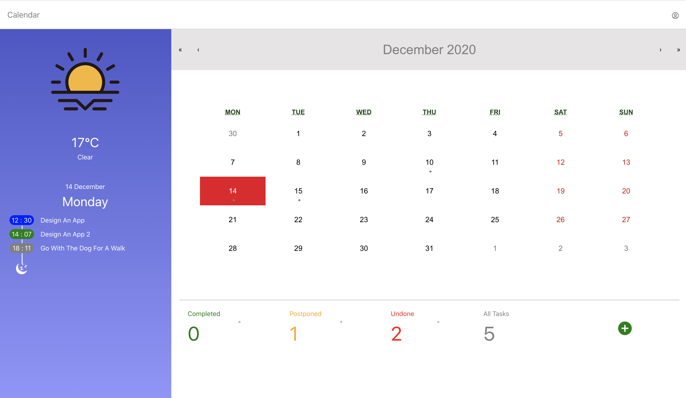

# Todo App

## Features
- Use Flex layout to implement responsive for mobile and desktop;
- Use Scss for styling;
- Use React-Calendar for calendar, React-Bootstrap for modals and forms, React-Icons for icons;
- Use Redux store to state management;
- Use Axios to handle HTTP requests;
- Use json-server to server a mock API;
- Mock API offers:
  - GET Todo list
  - GET Todo status list : Todo/Completed/Postponed/Undone
  - GET Todo category list : Work/Love/Other/Entertainment/Life
  - POST todo
  - PUT todo
  - Delete todo
- Integrate with [https://openweathermap.org/](https://openweathermap.org/) API to display current weather on user's location;

## Available Scripts

In the project directory, you can run:

### `npm run dev`

Runs the app in the development mode <b style="color:green;">with</b> mock API. 
Open [http://localhost:4200](http://localhost:4200) to view it in the browser. 
The app will consume the mock API at [http://localhost:3000](http://localhost:3000) 

The page will reload if you make edits. 
You will also see any lint errors in the console. 

### `npm start`

Runs the app in the development mode <b style="color:red;">without</b> mock API. 
Open [http://localhost:4200](http://localhost:4200) to view it in the browser.

The page will reload if you make edits. 
You will also see any lint errors in the console. 

### `npm test`

Launches the test runner in the interactive watch mode. 

### `npm run build`

Builds the app for production to the `build` folder. 

## Something Can Be Optimazed

- Resonsive across more different screen sizes, platforms and orientations;
- Theming and styling;
- Support Delete/Update/Filter todos;
- Unit tests and tests' code coverage;
- Security : Get rid of the API key of weather endpoint from code
- Support gesture on mobile;
- Support Add todo on mobile;
- User login/authentication;
- User data persistence;

## Desktop Add Todo Screenshot

## Mobile Screenshot

